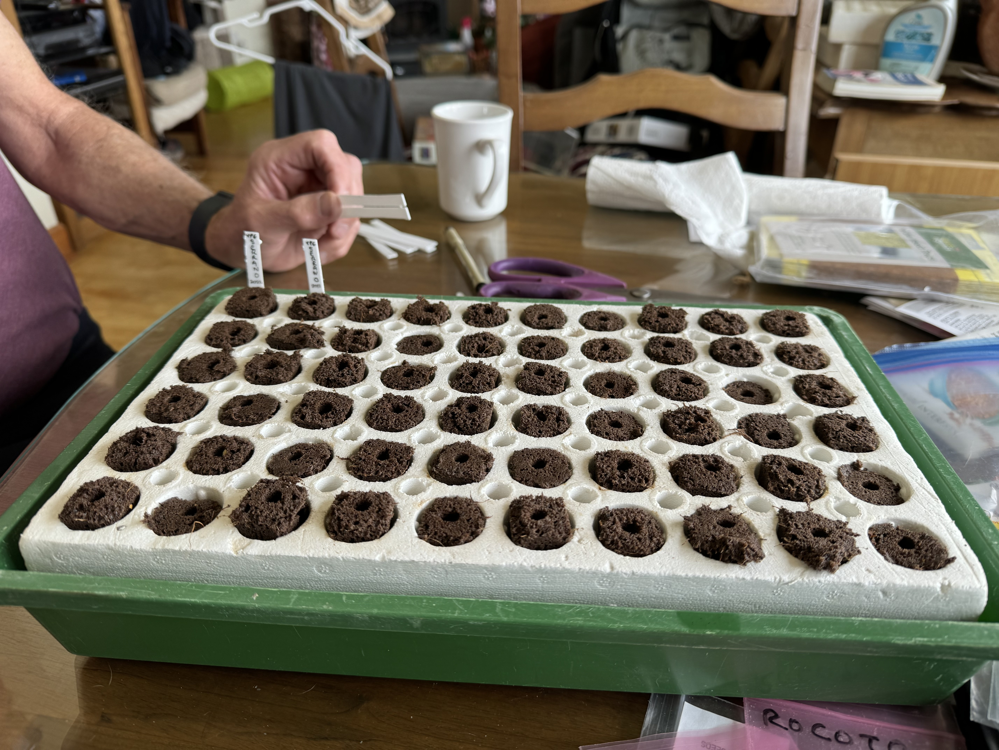
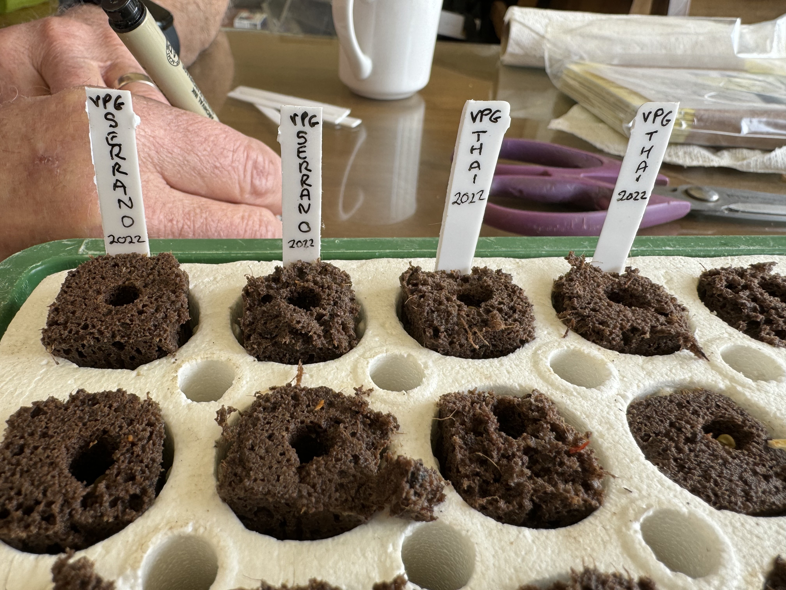

## Varieties we are growing

### In our outdoor greenhouse

* Peppers
    * Serrano
    * Thai
    * ...
* ...

### Still indoors

* ?

## Methodology

People (like Matt) often ask questions about how we start our seeds. This page will
enable us to share that information with others more robustly!

You are welcome to use the "Edit this page" or "Report an issue" links to the right to
help correct mistakes, fill in gaps, link to helpful resources, etc.!

### Equipment

* Outdoor greenhouse with electricity or a well-lit indoor space
* Jiffy pots
* Heat mats
* ...?

### Steps and important considerations

_TODO_

## Pictures

